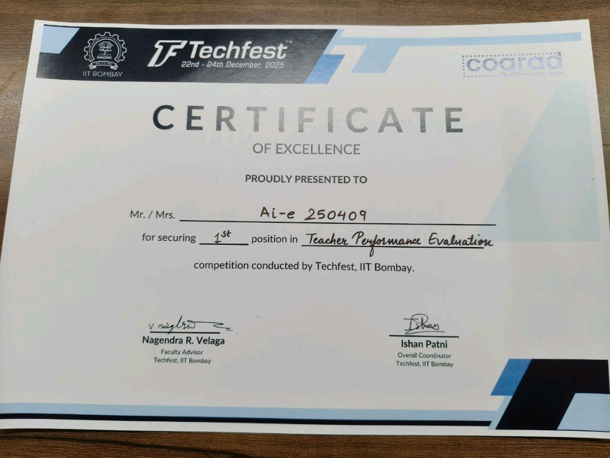

# TIE — Teacher Insight Engine.
> **Multimodal AI for actionable teaching feedback**

## 🏆 Recognition
**Rank 1 — IIT Bombay Techfest (Eduthon)**



TIE is a privacy-conscious teaching analytics platform that turns classroom or lecture recordings into structured feedback for educators.

## 👥 TEAM INFERNOX
| Name | Role |
|---|---|
| Vishwa Prakash | Team Leader & Researcher |
| Priyam Tiwari | Data Pipeline Leader |
| Shreya Singh | AI Logic Leader |
| Vaishali | Frontend UI Leader |

## What it does
TIE combines **audio, video, and language signals** to help educators understand how they deliver a session.
- 🎙️ **Speech & delivery** — transcription, pace, clarity and vocal-energy signals
- 👁️ **Visual behaviour** — attention, posture and non-verbal communication signals
- 🧠 **Language analysis** — content complexity and communication patterns
- 🤝 **Interaction insights** — session-level engagement indicators
- 📊 **Actionable feedback** — converts raw signals into understandable teaching insights

## Why TIE?
Teacher feedback is often subjective, infrequent and difficult to quantify. TIE is designed as an AI co-pilot that helps educators review a session using measurable signals instead of relying only on manual observation.

## Architecture
```text
Teaching Session
      │
      ├── Audio ──► Speech / Acoustic Analysis ──┐
      │                                           │
      ├── Video ──► Vision / Behaviour Analysis ──┼──► Fusion ──► Insights
      │                                           │
      └── Text  ──► NLP / Language Analysis ──────┘
```

## Core technology
- **Backend:** Python, FastAPI
- **Speech:** Whisper / Azure Speech
- **Vision:** MediaPipe, OpenCV
- **Media processing:** FFmpeg
- **Data:** MongoDB Atlas
- **Reporting:** ReportLab
- **Frontend:** React / Flutter (project variants)

## Product direction
**Record → Analyze → Understand → Improve**
The goal is to make high-quality teaching feedback more accessible, consistent and actionable.

## Repository note
This repository contains the Azure-oriented TIE implementation. Other prototype components are maintained separately during development.

## Team Work
Built as a student-led AI/EdTech project focused on multimodal analysis, product design and practical deployment.
